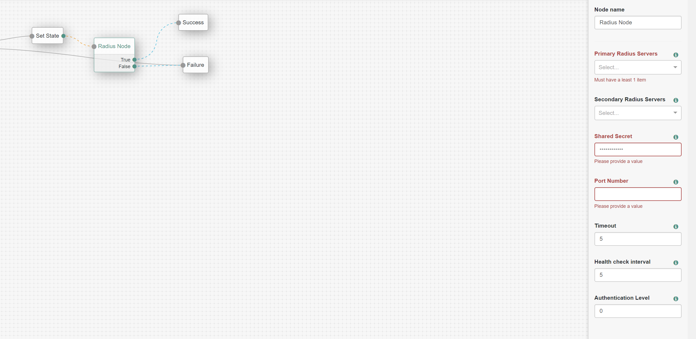

# Radius Server Node

A Radius Server Authentication node for ForgeRock's Access Manager 6.5.2 and above.
The Remote Authentication Dial-In User Service (RADIUS) authentication node lets AM authenticate users against RADIUS servers.

## Installation
Copy the .jar file from the ../target directory into the ../web-container/webapps/openam/WEB-INF/lib directory where AM is deployed. Restart the web container to pick up the new node. The node will then appear in the authentication trees components palette.

## Usage
To deploy this node and set appropriate config values where:
- **Primary and Secondary Radius Servers:** A list of Radius servers that will be used for authentication.
The module will use these servers in preference to the secondary servers.
A single entry must be in the format:radius_server:port
Multiple entries allow associations between OpenAM servers and a Radius server.
The format is:local server name | radius_server:port
The local server name is the full name of the server from the list of servers and sites.
- **Shared Secret:** The secret shared between the RADIUS server and the authentication node.
- **Port Number:** Port number on which the RADIUS server is listening.
- **Timeout:** Amount of time in seconds to wait for the RADIUS server response.
This sets the SO_TIMEOUT timeout on the packet.
- **Health check interval:** The interval between checks to unavailable RADIUS servers, in minutes.
Determines how often OpenAM checks an offline server's status. The check will send an invalid authentication request to
the RADIUS server. Offline servers will not be used until the healthcheck was successful. Primary servers that become available will be
used in preference to secondary servers.
- **Authentication Level:** The authentication level associated with this module.
Each authentication module has an authentication level that can be used to indicate the level of security
associated with the module; 0 is the lowest (and the default).

## To Build
The code in this repository has binary dependencies that live in the ForgeRock maven repository.
Maven can be configured to authenticate to this repository by following the following [ForgeRock Knowledge Base Article](https://backstage.forgerock.com/knowledge/kb/article/a74096897).
Edit the necessary RadiusNode.java as appropriate. To rebuild, run "mvn clean install" in the directory containing the pom.xml

## Disclaimer
The sample code described herein is provided on an "as is" basis, without warranty of any kind, to the fullest extent permitted by law. 
ForgeRock does not warrant or guarantee the individual success developers may have in implementing the sample code on their development platforms or in production configurations.

ForgeRock does not warrant, guarantee or make any representations regarding the use, results of use, accuracy, timeliness or completeness of any data or information relating to the sample code. 
ForgeRock disclaims all warranties, expressed or implied, and in particular, disclaims all warranties of merchantability, and warranties related to the code, or any service or software related thereto.

ForgeRock shall not be liable for any direct, indirect or consequential damages or costs of any type arising out of any action taken by you or others related to the sample code.

